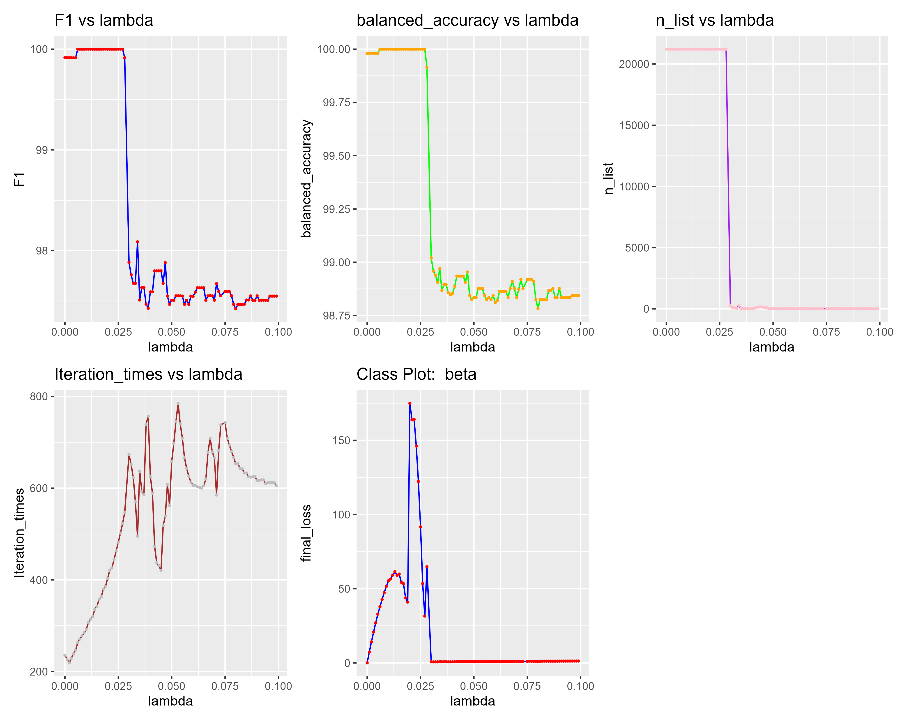
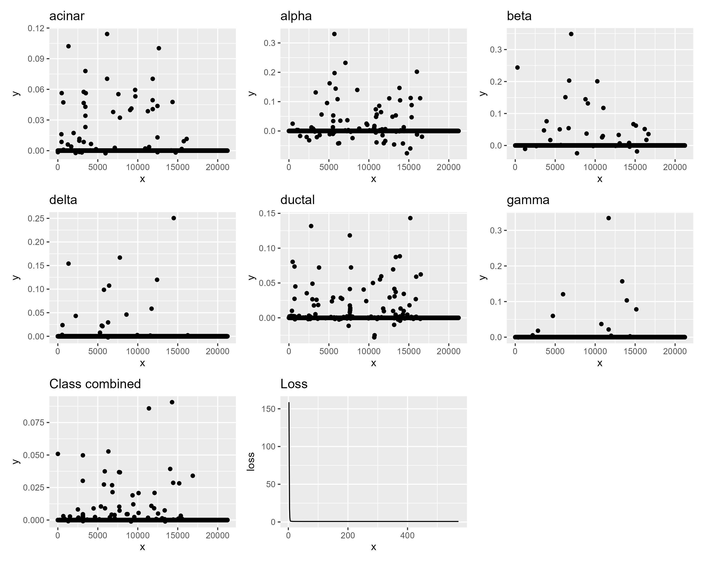
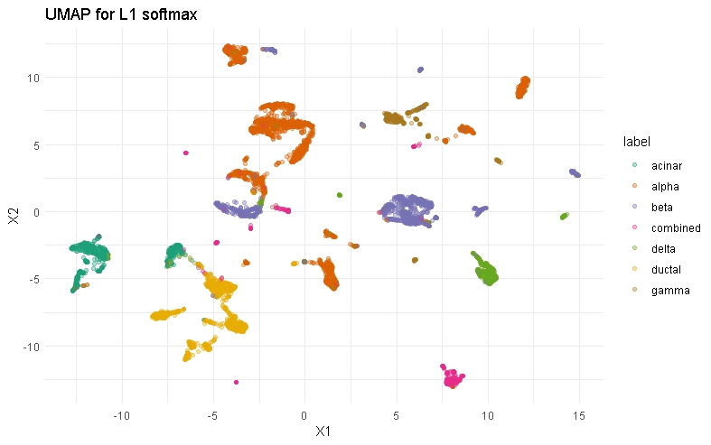

# Brief Introduction

Fast Iterative Shrinkage-Thresholding Algorithm (FISTA) is a fast optimization algorithm for solving the L1-regularized least squares problem. And its cpp code is implemented in the `fista.cpp` file under `cpp` directory.

The loss functions and gradient functions are defined in the `softmax.h` file under `cpp` directory, thus basically, by correctly writting the loss and gradient function with a head file, `fista.cpp` could be reused for solving other sparse optimization problems.

An example based on the reduced dimenional data using PCA is implemented in the `example.R` file under the `R` directory. The dataset is in the `example_data` directory. And the `eval.R` file under the`R` directory implments some basic evaluation function and plot function explicitly for this case.

The original team project completed during the 625 course is at "https://github.com/petercrimson2023/CellTypeClassification" 

A simple shiny app is also implemented in the `shiny_draft.R` file under the `shiny_example` directory. Due to the uploading limit, only a small part of the result including figures and tables are uploaded. And because of the usage limit of the Greatlakes server obtained in the 625 course, some of the plots for eta=1.2 cases are not drawn. The file `shiny_draft.R` could be tested in Rstudio by running the app.

# Results for quick look


## Brief introduction on multilevel logistic regression (softmax regression) and fista algorithm

Softmax regression is generalization of two level logistic regression has a defination $\hat{y}_i = argmax_{j=1}^k (\frac{exp(x_i^T \theta_j)}{ \sum_{j=1}^k exp(x_i^T \theta_j) })$. In this senario, target loss function with L1 regularization is $L(\theta)= f(\theta)+ \lambda g(\theta) = -\frac{1}{n} \sum_{i=1}^n \sum_{j=1}^k I\{ y_i=j \} ln(\frac{e^{x_i^T\theta_j}}{\sum_{l=1}^k x_i^T \theta_l})+\lambda \sum_{i=1}^k ||\theta_i||_1$. The proximal gradient according to the paper proposing the fista algorithm has the form $\theta^{k+1}=p_{\lambda,\frac{1}{L}}(\theta^k)=(|u|-\frac{\lambda}{L})_{+}sgn(u)$ where $u = \theta^k - \frac{1}{L}\nabla f(\theta^k)$ solving from the equation $\nabla f(\theta^k)+L(\theta^{k+1}-\theta^k)+\gamma(\theta^k)=0, \quad \gamma \in \partial g(\theta^{k+1})$

## Statistical learning classification with L1 regularization

Due to the unbalanced data, some of the cell types are merged into one class called combined class.
After finetuning model with $\lambda$ ranges from 0 to 1, with 0.001 step size, we choose to set $\lambda = 0.033$ and according to the F1 score and balanced accuracy. 
The iteration plots are as follows, and also the result of the compressed coefficients are plotted in the following figure.

```{r,echo=FALSE,fig.show='hold',fig.cap=c("key results over lambda and non-zero coefficients"), fig.align='center'}
library(knitr)


```

After deciding the $\lambda$, we find the first five genes influential for classifying specific cell types in terms of the absolute value of parameters. The results are as follows:

| **acinar**    | GSTA2   | BCAT1   | RNASE1   | CTRB2   | GSTA1    |
|---------------|---------|---------|----------|---------|----------|
| ****          | 0.114   | 0.102   | 0.1      | 0.078   | 0.07     |
| **alpha**     | GCG     | IRX2    | TTR      | GC      | FAP      |
| ****          | 0.33    | 0.232   | 0.202    | 0.197   | 0.162    |
| **beta**      | INS     | ADCYAP1 | IAPP     | NPTX2   | HADH     |
| ****          | 0.349   | 0.244   | 0.203    | 0.201   | 0.151    |
| **delta**     | SST     | LEPR    | BCHE     | RBP4    | HHEX     |
| ****          | 0.251   | 0.167   | 0.154    | 0.12    | 0.107    |
| **ductal**    | TINAGL1 | CFTR    | KRT19    | SLC4A4  | SERPING1 |
| ****          | 0.143   | 0.132   | 0.118    | 0.088   | 0.087    |
| **gamma**     | PPY     | SERTM1  | GPC5-AS1 | SLITRK6 | THSD7A   |
| ****          | 0.334   | 0.157   | 0.121    | 0.103   | 0.078    |
| **remaining** | SPARC   | PMP22   | HCLS1    | A2M     | COL4A1   |
| ****          | 0.091   | 0.086   | 0.053    | 0.051   | 0.05     |

The UMAP result is as follows:

```{r,echo=FALSE,fig.cap=c("umap result"), fig.align='center'}
library(knitr)


```


